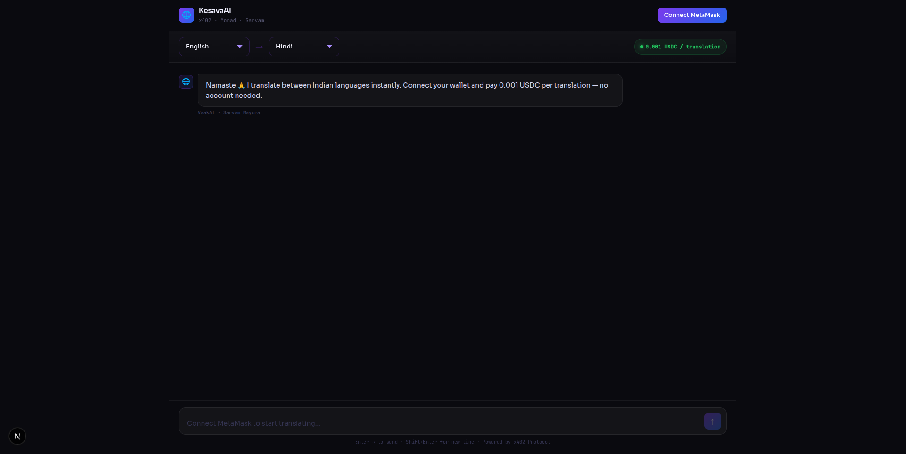
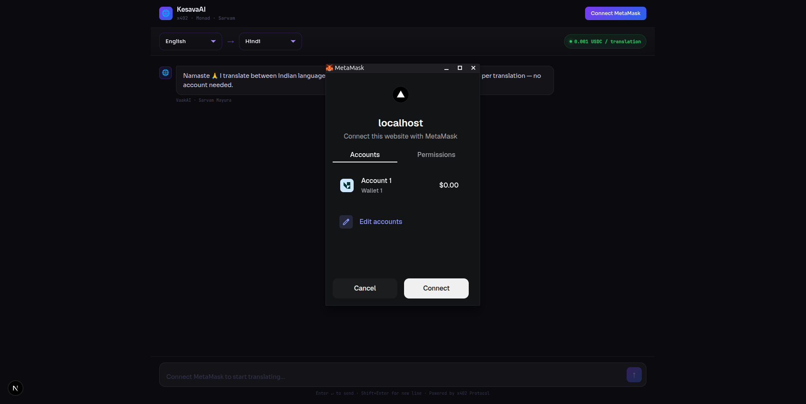
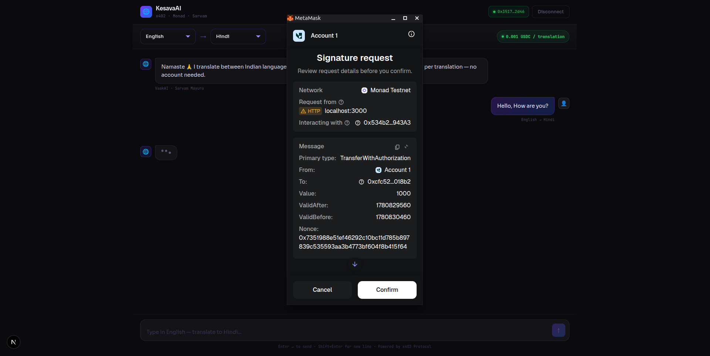
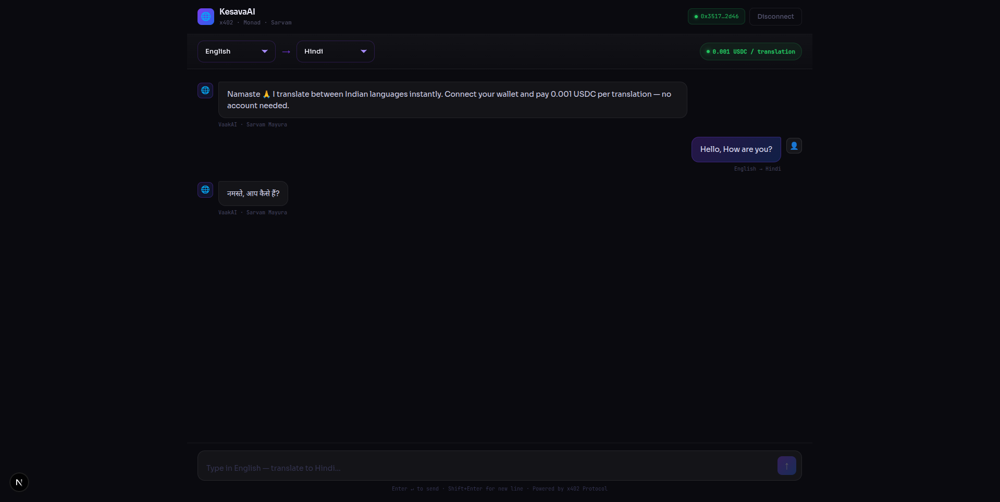

# Pay-to-Access APIs

> Authentication is friction. Payment is authorization.

## Overview

Modern APIs are designed for humans, not autonomous agents.

...

## Demo

### 1. Before Connection

This is the initial state before a wallet is connected.



---

### 2. After Connection

The wallet is successfully connected and ready to interact with the platform.



---

### 3. Making Payment

The agent/user authorizes payment for accessing the API endpoint.



---

### 4. Getting the Result

After payment verification, the API response is returned instantly.



---

## Problem

AI agents are becoming increasingly capable of performing real-world tasks, but they struggle when interacting with APIs that require:

- User registration
- OAuth authentication
- API key management
- Subscription onboarding
- Manual billing setup

...

## Solution

This platform introduces a **payment-first API architecture**.

1. An agent discovers an API endpoint.
2. The endpoint specifies a price.
3. The agent authorizes payment.
4. Payment is verified on-chain or through the payment network.
5. Access is granted instantly.

...

## How It Works

```text
AI Agent
    │
    ▼
Discover API Endpoint
    │
    ▼
View Pricing
    │
    ▼
Authorize Payment
    │
    ▼
Payment Verification
    │
    ▼
Receive API Response